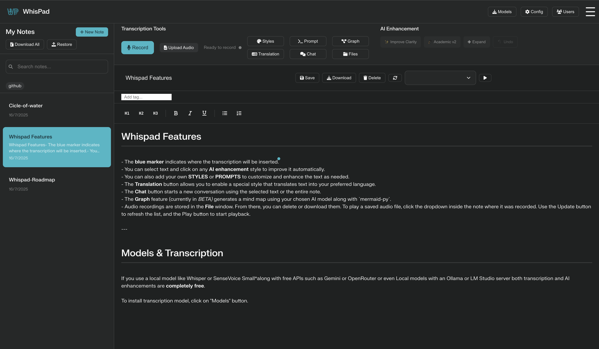
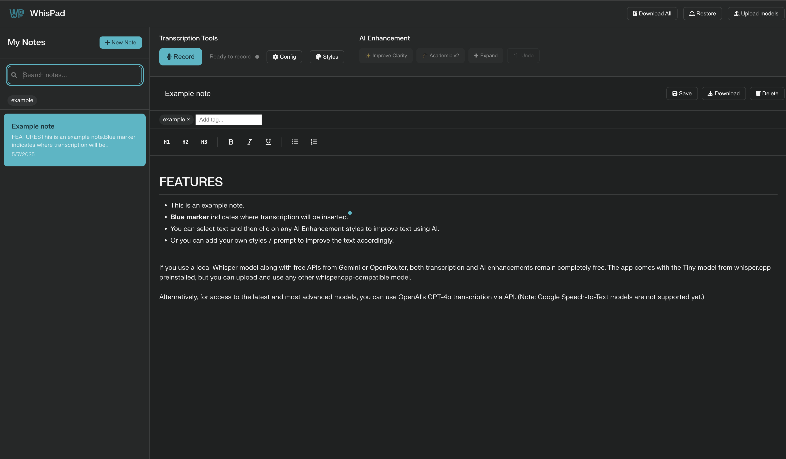
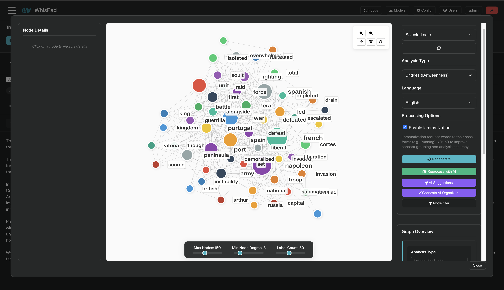
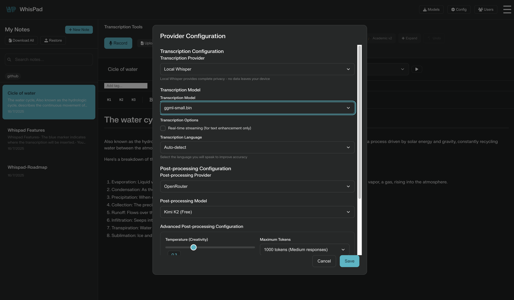

<p align="center">
  
</p>

# WhisPad

WhisPad is a transcription and note management tool designed so anyone can turn their voice into text and easily organize their ideas. The application lets you use cloud models (OpenAI) or local whisper.cpp models to work offline.

## Table of Contents
1. [Main Features](#main-features)
2. [Disclaimer](#disclaimer)
3. [Quick Setup](#quick-setup)
4. [Installing with Docker Desktop](#installing-with-docker-desktop)
5. [Installing from the Terminal](#installing-from-the-terminal)
6. [API Key Configuration](#api-key-configuration)
7. [Usage Guide](#usage-guide)
8. [Screenshots](#screenshots)

## Main Features
- Real-time voice-to-text transcription from the browser.
- Write and edit markdown notes.
- Integrated note manager: create, search, tag, save, restore and download in Markdown format.
- Automatic text enhancement using AI (OpenAI, Google or OpenRouter) with streaming responses.
- A blue marker indicating where the transcription will be inserted.
- Compatible with multiple providers: OpenAI, SenseVoice and local whisper.cpp. No model is bundled, but you can download tiny, small, base, medium or large versions from the interface.
- **NEW: SenseVoice Integration** - Advanced multilingual speech recognition with emotion detection and audio event recognition for 50+ languages.
- Download or upload local (.bin) whisper.cpp models directly from the interface.
- Export all notes in a ZIP file with one click.
- Mobile-friendly interface.
- User login with per-user note folders and admin management tools.

## Disclaimer
This application is currently in testing and is provided **as is**. I take no responsibility for any data loss that may occur when using it. Make sure you make frequent backups of your data.

## Quick Setup
If you are not comfortable with the terminal, the easiest method is to use **Docker Desktop**. You only need to install Docker, download this project and run it.

1. Download Docker Desktop from <https://www.docker.com/products/docker-desktop/> and install it like any other application.
2. Download this repository as a ZIP from GitHub and unzip it in the folder of your choice.
3. Open Docker Desktop and select **Open in Terminal** (or open a terminal in that folder). Type:
   ```bash
   docker compose up
   ```
4. Docker will download the dependencies and show *"Starting services..."*. When everything is ready, open your browser at `https://localhost:5037`.
5. Sign in with **admin** / **whispad** the first time to access the app.
6. To stop the application, press `Ctrl+C` in the terminal or use the *Stop* button in Docker Desktop.

## Installing with Docker Desktop
This option is ideal if you don't want to worry about installing Python or dependencies manually.

1. Install **Docker Desktop**.
2. Open a terminal and clone the repository:
   ```bash
   git clone https://github.com/tu_usuario/whispad.git
   cd whispad
   ```
   (If you prefer, download the ZIP and unzip it.)
3. Run the application with:
   ```bash
   docker compose up
   ```
4. Go to `https://localhost:5037` and start using WhisPad.
5. Log in with **admin** / **whispad** on first use.
6. To stop it, press `Ctrl+C` in the terminal or run `docker compose down`.
7. If you want to use LM Studio or Ollama for local AI text improvement, set the host to
   `host.docker.internal` in the configuration page so the container can reach
   your local instance.
   Use the **Update Models** button to fetch the list of available models from
   `http://<lmstudio-host>:<port>/v1/models` automatically.

## Installing from the Terminal
If you prefer not to use Docker, you can also run it directly with Python:

1. Make sure you have **Python 3.11** or higher and **pip** installed.
2. Clone the repository or download the code and go to the project folder:
   ```bash
   git clone https://github.com/tu_usuario/whispad.git
   cd whispad
   ```
3. Install the Python dependencies:
   ```bash
   pip install -r requirements.txt
   ```
4. Download a whisper.cpp model with the script or from the **Models** menu (no model is included by default):
   ```bash
   bash install-whisper-cpp.sh
   ```
   You can also download or upload models directly from the interface.
5. Run the server:
   ```bash
   python backend.py
   ```
6. Open `index.html` in your browser or serve the folder with `python -m http.server 5037` and visit `https://localhost:5037`.
7. Log in with **admin** / **whispad** the first time you access the app.

## API Key Configuration
Copy `env.example` to `.env` and add your API keys:
```bash
cp env.example .env
```
Edit the `.env` file and fill in the variables `OPENAI_API_KEY`, `GOOGLE_API_KEY`, `DEEPSEEK_API_KEY` and `OPENROUTER_API_KEY` for the services you want to use. These keys enable cloud transcription and text enhancement.
If you want to send each saved note to an external workflow (for example, an n8n or Dify instance), also set `WORKFLOW_WEBHOOK_URL` and optionally `WORKFLOW_WEBHOOK_TOKEN`.
You can override the username included in the webhook by defining `WORKFLOW_WEBHOOK_USER`.
The webhook payload now includes the username so your workflow can fetch the note from the correct folder.

## Usage Guide
1. Press the microphone button to record audio and get real-time transcription.
2. Select text fragments and apply style or clarity improvements with a click.
3. Organize your notes: add titles, tags and search them easily.
4. Download each note in Markdown or the entire set in a ZIP file.
5. Download additional whisper.cpp models from the **Models** menu (you can still drag and drop your own files) and enjoy offline transcription.
6. Use the **Restore** menu to import previously saved notes.

With these instructions you should have WhisPad running in just a few minutes with or without Docker. Enjoy fast transcription and all the benefits of organizing your ideas in one place!

## Screenshots

Here are some screenshots of WhisPad in action:

<p align="center">
  
</p>

<p align="center">
  
</p>

<p align="center">
  
</p>

<p align="center">
  
</p>

## SenseVoice Integration - Advanced Multilingual Transcription

WhisPad now includes **SenseVoice**, a state-of-the-art multilingual speech recognition model with unique capabilities:

### Key Features
- **50+ Language Support**: Including Chinese (Mandarin), Cantonese, English, Japanese, Korean, and many more
- **Emotion Recognition**: Automatically detects emotions (Happy, Sad, Angry, Neutral, Fearful, Disgusted, Surprised)
- **Audio Event Detection**: Identifies background music, applause, laughter, crying, coughing, sneezing, and more
- **Superior Performance**: 15x faster than Whisper-Large with higher accuracy for Asian languages
- **Complete Privacy**: All processing happens locally - no data leaves your device

### How to Use SenseVoice

1. **Download the Model**: Go to "Models" → Click "SenseVoice Small" to download the model (first time only)
2. **Configure**: In "Config" → Select "SenseVoice" as your transcription provider
3. **Customize**: Enable/disable emotion detection and audio event detection as needed
4. **Transcribe**: Record audio and get enhanced transcriptions with emotional context

### Supported Languages
- **Chinese**: Mandarin (zh), Cantonese (yue)
- **East Asian**: Japanese (ja), Korean (ko)
- **Western**: English (en), and 40+ additional languages
- **Auto-detection**: Automatically identifies the spoken language

### Advanced Features
- **Inverse Text Normalization**: Automatic punctuation and formatting
- **Batch Processing**: Efficient processing of longer audio segments
- **Rich Transcription**: Includes metadata about emotions and audio events
- **High Accuracy**: Outperforms Whisper on Chinese and Cantonese content

### Technical Details
SenseVoice is based on FunASR and provides enterprise-grade speech recognition capabilities. The model is approximately 234MB and runs efficiently on both CPU and GPU.

## Acknowledgements

This project was developed with the help of AI tools including **Perplexity Labs**, **OpenAI Codex**, and **Claude 4**. Local transcription models run thanks to [whisper.cpp](https://github.com/ggml-org/whisper.cpp) (a copy is bundled here for easier installation).

