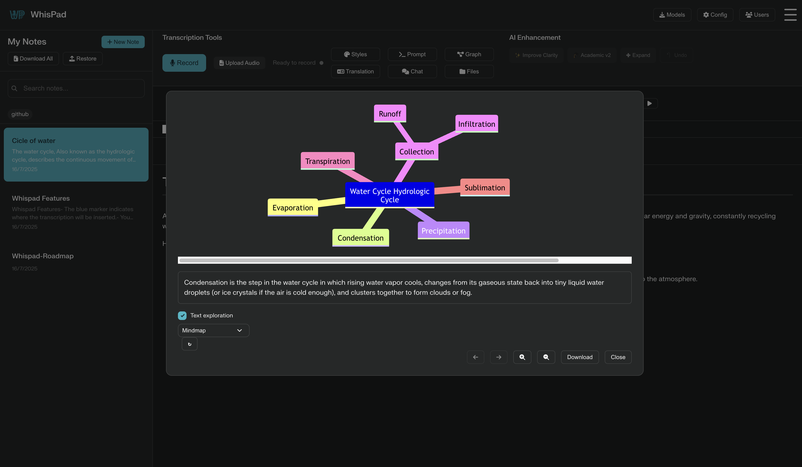

<p align="center">
  
</p>

# WhisPad

WhisPad is a transcription and note management tool designed so anyone can turn their voice into text and easily organize their ideas. The application lets you use cloud models (OpenAI, Google) or local whisper.cpp models to work offline.

## Table of Contents
1. [Main Features](#main-features)
2. [Disclaimer](#disclaimer)
3. [Quick Setup](#quick-setup)
4. [Installing with Docker Desktop](#installing-with-docker-desktop)
5. [Installing from the Terminal](#installing-from-the-terminal)
6. [API Key Configuration](#api-key-configuration)
7. [Usage Guide](#usage-guide)
8. [Screenshots](#screenshots)

## Main Features
- Real-time voice-to-text transcription from the browser.
- Write and edit markdown notes.
- Integrated note manager: create, search, tag, save, restore and download in Markdown format.
- Automatic text enhancement using AI (OpenAI, Google or OpenRouter) with streaming responses.
- A blue marker indicating where the transcription will be inserted.
- Compatible with multiple providers: OpenAI, Google and local whisper.cpp (tiny model included on this repo, but you can download small, base, medium or large)
- Ability to upload local (.bin) whisper.cpp models directly from the interface.
- Export all notes in a ZIP file with one click.
- Mobile-friendly interface.

## Disclaimer
This application is currently in testing and is provided **as is**. I take no responsibility for any data loss that may occur when using it. Make sure you make frequent backups of your data.

## Quick Setup
If you are not comfortable with the terminal, the easiest method is to use **Docker Desktop**. You only need to install Docker, download this project and run it.

1. Download Docker Desktop from <https://www.docker.com/products/docker-desktop/> and install it like any other application.
2. Download this repository as a ZIP from GitHub and unzip it in the folder of your choice.
3. Open Docker Desktop and select **Open in Terminal** (or open a terminal in that folder). Type:
   ```bash
   docker compose up
   ```
4. Docker will download the dependencies and show *"Starting services..."*. When everything is ready, open your browser at `http://localhost:5037`.
5. To stop the application, press `Ctrl+C` in the terminal or use the *Stop* button in Docker Desktop.

## Installing with Docker Desktop
This option is ideal if you don't want to worry about installing Python or dependencies manually.

1. Install **Docker Desktop**.
2. Open a terminal and clone the repository:
   ```bash
   git clone https://github.com/tu_usuario/whispad.git
   cd whispad
   ```
   (If you prefer, download the ZIP and unzip it.)
3. Run the application with:
   ```bash
   docker compose up
   ```
4. Go to `http://localhost:5037` and start using WhisPad.
5. To stop it, press `Ctrl+C` in the terminal or run `docker compose down`.

## Installing from the Terminal
If you prefer not to use Docker, you can also run it directly with Python:

1. Make sure you have **Python 3.11** or higher and **pip** installed.
2. Clone the repository or download the code and go to the project folder:
   ```bash
   git clone https://github.com/tu_usuario/whispad.git
   cd whispad
   ```
3. Install the Python dependencies:
   ```bash
   pip install -r requirements.txt
   ```
4. (Optional) Download a whisper.cpp model with the included script:
   ```bash
   bash install-whisper-cpp.sh
   ```
   You can also upload your own `.bin` models from the interface.
5. Run the server:
   ```bash
   python backend.py
   ```
6. Open `index.html` in your browser or serve the folder with `python -m http.server 5037` and visit `http://localhost:5037`.

## API Key Configuration
Copy `env.example` to `.env` and add your API keys:
```bash
cp env.example .env
```
Edit the `.env` file and fill in the variables `OPENAI_API_KEY`, `GOOGLE_API_KEY`, `DEEPSEEK_API_KEY` and `OPENROUTER_API_KEY` for the services you want to use. These keys enable cloud transcription and text enhancement.

## Usage Guide
1. Press the microphone button to record audio and get real-time transcription.
2. Select text fragments and apply style or clarity improvements with a click.
3. Organize your notes: add titles, tags and search them easily.
4. Download each note in Markdown or the entire set in a ZIP file.
5. If you have local whisper.cpp models, upload them from the **Upload models** menu and enjoy offline transcription.
6. Use the **Restore** menu to import previously saved notes.

With these instructions you should have WhisPad running in just a few minutes with or without Docker. Enjoy fast transcription and all the benefits of organizing your ideas in one place!

## Screenshots

Here are some screenshots of WhisPad in action:

<p align="center">
  
</p>

<p align="center">
  
</p>

<p align="center">
  
</p>

<p align="center">
  
</p>

